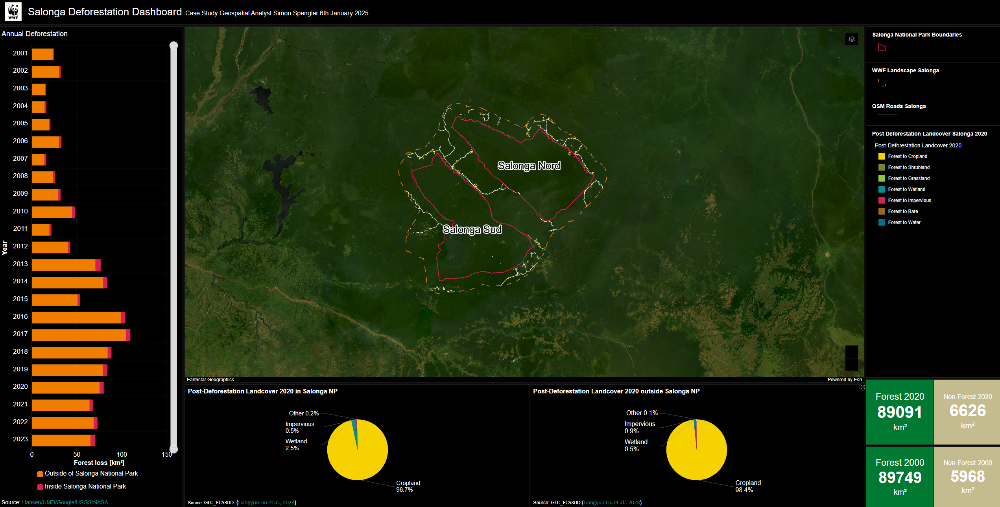

# Case Study Geospatial Analyst Salonga-Dashboard

These scripts are used for the analysis of forest dynamics in the Salonga National Park.

Results are integrated in a dashboard: https://panda.maps.arcgis.com/apps/dashboards/2fab00b1e6474537b0a00dbe4d2e524a

